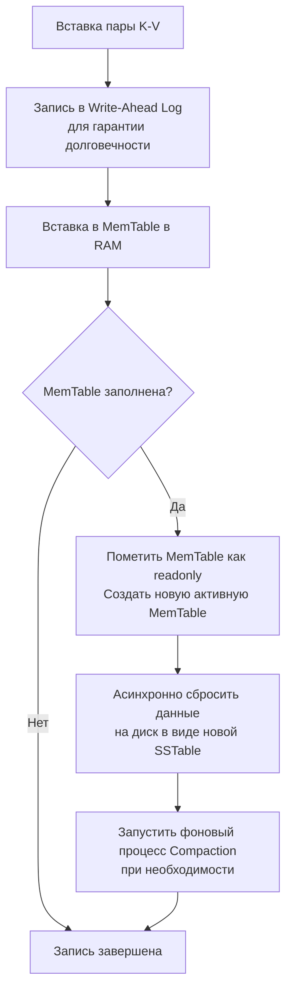
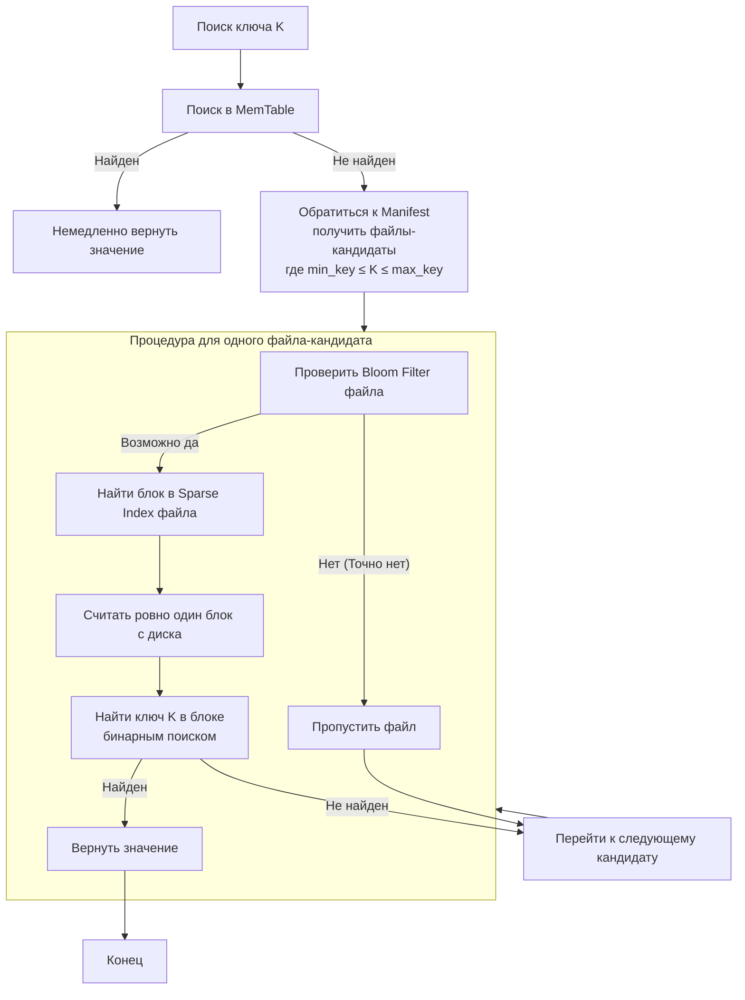
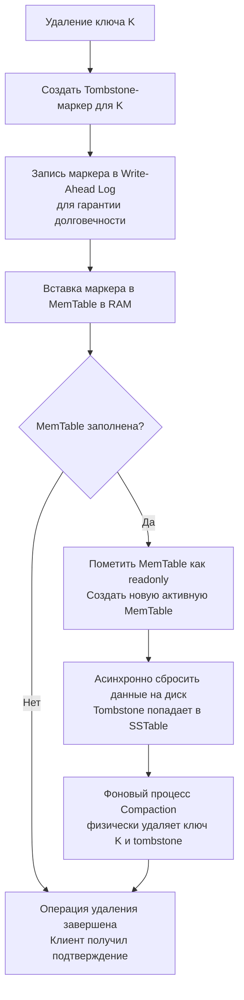

#### Связанные темы: [[Bloom Filter]], [[B-дерево]], [[Skip-list]], [[Red-black Tree]], [[AVL Tree]]

**LSM-дерево (Log-Structured Merge-Tree)** — это не совсем дерево в классическом понимании (как B-tree). Это скорее **архитектурный подход** или 
**алгоритмическая структура** для организации данных, оптимизированная **под высокую скорость операций записи** (вставка, обновление, удаление), в ущерб скорости чтения в некоторых сценариях. LSM-дерево — это не просто академическая структура данных, а **краеугольный камень реальных движков хранения** (storage engines) для многих современных высокопроизводительных баз данных.

Можно сказать, что оно является **архитектурной основой** или **сердцем** таких движков.

Его основная идея — **отказаться от случайных операций записи на диск** (которые медленные) и преобразовать их в **последовательные записи** (которые быстрые), откладывая дорогостоящие операции сортировки и слияния на фоновые процессы.

---

## Компромиссы LSM-дерева (Trade-offs)

### **Преимущества**

*   **Очень высокая скорость записи:** Записи идут последовательно в WAL и в RAM-структуру. Это намного быстрее, чем случайные записи в B-деревьях.
*   **Отличная масштабируемость:** Отлично подходит для write-intensive workload (больших потоков записи).
*   **Эффективное сжатие:** Данные в SSTable отсортированы и отлично сжимаются, экономя место на диске.

### **Недостатки**

*   **Задержки при чтении:** Чтение может быть медленнее, чем в B-деревьях, так как может потребовать проверки нескольких уровней (MemTable + несколько SSTable). Это известно как **"read amplification"**.
*   **Накладные расходы на Compaction:** Фоновый процесс compaction может потреблять значительные ресурсы CPU и I/O, что иногда может мешать основным операциям (**"write amplification"**).
*   **Неопределенность чтения:** В отличие от B-дерева, где время чтения предсказуемо, время чтения в LSM-дереве может варьироваться в зависимости от того, на каком уровне находятся данные.

---

## Где используется?

LSM-деревья лежат в основе многих современных высокопроизводительных СУБД, особенно типа "ключ-значение" и NoSQL:

*   **Google LevelDB, RocksDB** (используется в MySQL MyRocks, Cassandra, Kafka)
*   **Apache Cassandra**
*   **Apache HBase**
*   **Bigtable** (от Google)
*   **InfluxDB** (база данных для временных рядов)
*   **ClickHouse** (аналитическая БД)

---
### Как LSM-алгоритм реализован в движках БД?

LSM-дерево — это не готовая БД, а принцип организации данных. На его основе создаются **движки хранения** (storage engines), которые затем используются в:

1.  **Как самостоятельный движок "ключ-значение":**
    *   **LevelDB:** Эталонная реализация от Google. Относительно простая и надежная.
    *   **RocksDB:** Развитие идей LevelDB от Facebook. Значительно более продвинутая, производительная и настраиваемая версия, ставшая *де-факто* стандартом для встраиваемых движков. Именно она чаще всего и стоит под капотом у многих современных систем.
    
2.  **Как основа для NoSQL- и NewSQL-СУБД:**
    Многие распределенные базы данных используют RocksDB или подобные движки в качестве *локального движка хранения* на каждом узле кластера.
    *   **Apache Cassandra:** Для хранения данных на каждом узле.
    *   **Apache HBase:** Built on top of подобной концепции (использует HFile).
    *   **CockroachDB:** В качестве одного из основных движков хранения.
    *   **TiDB:** Использует RocksDB в качестве базового слоя хранения.
    *   **ScyllaDB:** Высокопроизводительная реализация, вдохновленная Cassandra, но со своим собственным LSM-движком, оптимизированным под современное железо.
    
3.  **Как движок для аналитических (OLAP) и специализированных БД:**
    *   **ClickHouse:** Широко использует принципы LSM-дерева для быстрой вставки больших объемов данных и их последующего фонового слияния.
    *   **InfluxDB** (и другие базы данных для временных рядов): Идеально подходит из-за высокой скорости записи, так как данные часто поступают потоками и очень редко обновляются.
    
4.  **Даже внутри реляционных (SQL) СУБД:**
    *   **MySQL с движком MyRocks:** MyRocks — это плагинный движок хранения для MySQL, который использует RocksDB. Он предлагает гораздо лучшее сжатие данных и высокую производительность записи по сравнению с классическим InnoDB (который основан на B+ деревьях) в определенных сценариях.
    *   **MongoDB:** Начиная с версии 3.2, ввела движок WiredTiger, который, хотя и является гибридным, активно использует концепции LSM для управления данными на диске.

---

### Почему LSM так популярен для движков?

Потому что он идеально решает проблемы современных систем:

1.  **Скорость записи:** Современные приложения генерируют колоссальные объемы данных (логи, события, телеметрия, IoT). LSM-движки поглощают эту нагрузку лучше всего.
2.  **Эффективное сжатие:** Отсортированные данные в SSTable сжимаются намного лучше, чем страницы в B-дереве. Это **значительно экономит место на диске** и снижает стоимость хранения.
3.  **Предсказуемая производительность:** Запись почти всегда происходит в RAM (в MemTable), что делает её очень быстрой и стабильной. Проблемы с производительностью (если они возникают) обычно связаны с фоновым compaction'ом, который можно тонко настраивать.
4.  **Износ SSD (Wear Leveling):** LSM-движки производят больше *записей на диск* (из-за compaction), но эти записи являются *последовательными*. Для SSD (особенно Enterprise-уровня) последовательная запись предпочтительнее случайных, так как она снижает износ ячеек памяти и позволяет контроллеру эффективнее работать с памятью.

---
## Мотивация(для чего нужна SST и подобные структуры данных)

Самая простая база данных может выглядеть как обычный файл, в который новые данные (пары «ключ–значение») добавляются в конец. Поиск осуществляется линейно: мы последовательно просматриваем весь файл, пока не найдём нужный ключ или не дойдём до конца.

Такая реализация крайне проста, но имеет серьёзные недостатки:
- **Поиск выполняется за линейное время** — сложность O(n).
- При этом совершается **огромное количество операций ввода-вывода (I/O)** с диска, который является самым медленным компонентом системы.

Например, если искомый ключ находится ближе к концу файла, а сам файл весит гигабайты, то до его нахождения мы вынуждены будем **прочитать огромный объём ненужных данных** — что крайне неэффективно.

### Как можно это оптимизировать?

Цель — **минимизировать количество операций I/O с диском** и **максимально перенести работу в оперативную память (RAM)**, где доступ к данным происходит в тысячи раз быстрее.

Однако здесь возникает проблема: современные базы данных часто содержат **гигабайты или даже терабайты данных** — и ни одна оперативная память не в состоянии вместить всё.

### Вывод:

Хранить **всю** базу данных в RAM невозможно.  
Но можно хранить в RAM **метаинформацию**, которая позволит **свести количество обращений к диску к минимуму** — желательно, чтобы по ключу можно было **сразу определить точное (или приблизительное) расположение данных на диске**, и считать только нужный блок.

Именно такая идея лежит в основе **SSTables (Sorted String Tables)** и других индексных структур:  
в оперативной памяти хранится **индекс** — например, хеш-таблица или дерево, — который по ключу возвращает **смещение в файле**, где находятся нужные данные. Это позволяет:
- избежать полного сканирования файла,
- читать с диска **только один блок**,
- достичь поиска за O(1) или O(log n) вместо O(n).

Таким образом, разумное использование RAM не для хранения самих данных, а для **хранения информации о их расположении**, становится ключом к высокой производительности баз данных.

Продолжая рассуждения, можно прийти к следующей архитектуре нашей самодельной базы данных. Она состоит из трёх основных частей:

1. **Блок данных** — хранит пары «ключ–значение».  
   Пока не требуется сортировка: данные записываются последовательно, по мере поступления.

2. **Индекс** — структура в оперативной памяти, позволяющая быстро находить данные на диске.  
   Пусть это будет простая хеш-таблица, где:
   - ключ — это сам ключ из пары «ключ–значение»,
   - значение — смещение относительно начала файла, где начинается соответствующий блок данных.  
   Это позволяет по ключу мгновенно получить позицию в файле и выполнить единичное чтение с диска.

3. **Суперблок** — участок с метаинформацией, расположенный, например, в начале или конце файла.  
   Он хранит служебные данные:  
   - где начинается блок данных,  
   - где начинается индекс (или его образ на диске),  
   - их размеры,  
   - версию формата,  
   - контрольные суммы и другую критически важную информацию.  
   При запуске БД суперблок читается первым — он «рассказывает», как восстановить состояние системы.

Это версия нашей БД(**архитектура индексированных файлов**) выглядит намного лучше первоначальной но все еще она имеет несколько критических недостатков:

### Преимущества этой схемы:

*   **Мгновенное чтение по ключу (O(1) в среднем)**: Это главный плюс. Чтобы прочитать значение, системе нужно:
    1.  Посмотреть в хеш-таблицу в RAM, получить смещение `offset`.
    2.  Сделать **ровно один seek** на диск по адресу `offset`.
    3.  Прочитать ровно столько байт, сколько нужно для этой записи.
    *Это колоссально быстрее, чем линейный поиск по всему файлу.*

*   **Простота реализации**: Концепция очень проста для понимания и кодирования.

### Проблемы, которые нужно решить (и как их решают в "промышленных" вариантах):

| Проблема                                   | В вашей схеме                                                                                                                                                                                                                                                                                                                                         | Решение (эволюция)                                                                                                                                                                                                                                                    |
| :----------------------------------------- | :---------------------------------------------------------------------------------------------------------------------------------------------------------------------------------------------------------------------------------------------------------------------------------------------------------------------------------------------------- | :-------------------------------------------------------------------------------------------------------------------------------------------------------------------------------------------------------------------------------------------------------------------- |
| **1. Запись (Write Amplification)**        | Чтобы записать пару `(K, V)`, вам нужно:   1. Записать `V` в конец data-файла.   2. **Обновить хеш-таблицу в RAM** (добавить `K -> new_offset`).   *Проблема:* Что, если мы перезаписываем значение для существующего ключа? Старая запись `(K, V_old)` остаётся в файле **мертвым грузом**, занимая место. Это называется **фрагментация**. | **SS-Table:** Данные периодически перезаписываются в отсортированные, неизменяемые файлы, в процессе **compaction**'а старые версии ключей удаляются.                                                                                                                 |
| **2. Размер индекса**                      | Если у вас 1 млрд ключей, то в RAM вам понадобится хеш-таблица на 1 млрд записей. Это может быть **несколько гигабайт** чисто под индекс. Для некоторых систем это неприемлемо.                                                                                                                                                                       | **SS-Table + Разреженный индекс:** В RAM хранится индекс не на каждый ключ, а только на **начало каждого блока** (например, раз в 64 КБ данных). Это сокращает размер индекса в тысячи раз.                                                                           |
| **3. Устойчивость (Durability)**           | Ваш индекс живёт **только в RAM**. Если сервер внезапно выключится, вся эта хеш-таблица исчезнет. При перезапуске БД придётся **заново перестраивать весь индекс**, проходя по всему data-файлу (что очень долго для большого файла).                                                                                                                 | **Write-Ahead Log (WAL):** Перед каждым обновлением индекса в RAM, операция записи сначала дописывается в отдельный **последовательный лог** на диске. При перезапуске этот лог "проигрывается", чтобы восстановить состояние индекса в RAM. Это стандартное решение. |
| **4. Range-запросы (Диапазонные запросы)** | Запросы вида "найти все ключи от `A` до `B`" выполняются **ужасно**. Хеш-таблица не знает ничего о порядке ключей. Вам придётся перебрать все ключи в индексе, найти те, что в диапазоне, и затем сделать много случайных чтений с диска.                                                                                                             | **SS-Table:** Ключи отсортированы, поэтому range-запросы выполняются очень эффективно — нужно просто найти начало диапазона и читать данные последовательно с диска.                                                                                                  |

Раз все еще очень накладно хранить милионы ключей в хеш таблице, то можно придумать очередное улучшение способное обойти и эту проблему. 

Речь о  **разреженных индексах (sparse index)**. Вместо того чтоб бы хранить все ключи в хеш таблице мы можем хранить данные на диске(пару ключ и значение) отсортированными по ключу. В таком случае нам в оперативной памяти достаточно хранить первый или последний ключ каждого блока. Так как ключи внутри блока отсортированы мы легко можем узнать в каком блоке может находится искомый ключ и соответвенно смещение внутри файла где лежат данные по этому ключу.
Например, чтобы найти ключ `X`, мы:

- **В RAM:** Просматриваем разреженный индекс, чтобы найти два соседних ключа, между которыми находится `X`. Это определяет **ровно один блок** на диске, где может находиться `X`.

- **На диске:** Делаем **всего одно чтение** — считываем этот один блок целиком.
   
- **В RAM (снова):** Поскольку данные _внутри блока отсортированы_, мы быстро (бинарным поиском) находим нужный ключ `X` внутри считанного блока.

Таким образом мы существенно сократим количество хранимой информации в оперативной памяти. В этом и суть **разреженного индекса (sparse index).**

**Разреженный индекс (sparse index) почти всегда представляет собой отсортированный массив или список пар «ключ-смещение».** Чаще всего оно реализовано как отсортированный массив или самобалансирующиеся деревья(например, красно-черные деревья), так как нам нужно своиство отсортированности по отношению к ключам, но никак не хеш-таблицы из-за своиства неупорядоченности.

## Обновление данных

Со вставкой и поиском разобрались, но что если мы хотим поменять значение ключа. Самый банальный способ как это сделать может быть таким: 
1) Сначало идем в разряженный индекс искать нужный ключ;
2) Найдем нужный блок данных(смещение относительно файла);
3) Внутри нужного блока данных линкйным посиком находим нужный ключ и обновляем его данные.
На первый взгляд, всё логично — но есть одна фундаментальная проблема. Блоки данных у нас фиксированного размер, что если после обновления мы не будем укладыватсья в лимиты по размерам блока данных, а даже если лимитов у нас нету, все равно все записи в файле у нас идут последовательно в файле. Допустим прежнее значение ключа у нас занимало в памяти 1024 байт, а обновленное занимает в 2 раза больше, записать их все мы не можем, так как банально после первых 1024 байт идет память под следующую пару. Возникает ситуация в которой некоторые операции обновления значении ключа могут потребовать частичного или полного перераспределения ключей и их значений внутри этого файла, что довольно дорого по времени исполнении операции.

В таком случае мы может поити по другому пути, пусть все подобные файлы будут только на чтение. Главное свойство: **SS-таблицы — неизменяемые (immutable).** Файл, однажды записанный на диск, никогда не изменяется. Это принципиальное архитектурное решение.

### Как обновления реализованы на практике

1.  **Обновление — это новая запись**
    Система не ищет и не перезаписывает старое значение. Вместо этого она просто записывает **новую пару ключ-значение** с тем же ключом, но обновленным значением.
    *   Запись `{key: "user:123", value: "{"name": "John"}"}` -> `{key: "user:123", value: "{"name": "Jane"}"}`

2.  **Куда записывается это обновление?**
    *   Сначала оно попадает в структуру в **оперативной памяти (RAM)**, которая называется **MemTable** (чаще всего это отсортированное дерево, например,  [[AVL Tree]] , [[Red-black Tree]] или [[Skip-list]]) **"На практике чаще всего используется Skip-list (как в LevelDB), потому что он проще в реализации и хорошо работает под конкурентной записью."**.
    
    *   Когда MemTable переполняется, её содержимое (уже отсортированное) **"сбрасывается" (flush)** на диск в виде **новой SS-таблицы**.

3.  **Что теперь? У нас несколько версий одного ключа!**
    Теперь в системе есть две SS-таблицы:
    *   **Старая SS-таблица:** Содержит `"user:123" -> "John"`
    *   **Новая SS-таблица:** Содержит `"user:123" -> "Jane"`

    При поиске система просматривает все SS-таблицы **от самых новых к самым старым**. Поэтому, когда она найдет ключ `"user:123"` в новой таблице, она вернет значение `"Jane"` и остановится. Старая версия будет проигнорирована.

Данный подход с версионированием решает все наши проблемы, но и создает одну новую - избыточность данных. Теперь мы дублируем данных, причем только одна из всех версии актуально, дургие просто занимают место. В некоторых кейсах это не критично, но в других очень даже, например если мы оперируем с милионами записей и у нас частые обновления данных. 

 **Решение проблемы множественных версий: Compaction (Уплотнение)** 
Здесь вступает в действие фоновый процесс. **Compaction** — это процесс слияния нескольких SS-таблиц, в ходе которого:

- Данные из нескольких маленьких SS-таблиц объединяются в одну большую **новую** SS-таблицу.

- **Для одного и того же ключа сохраняется только самая последняя версия** (потому что мы читаем данные из исходных таблиц в порядке их актуальности).

- Старые, ненужные SS-таблицы **удаляются** с диска.

Именно в процессе compaction'а "лишние" данные, вызванные обновлениями, удаляются, а также решается проблема, если обновление привело к увеличению размера значения.

---

### Механизм Compaction (на примере Leveled Compaction)

Этот процесс похож на сортировку слиянием:

1. **Уровень 0 (Level 0):** Новые, маленькие SS-таблицы, полученные из MemTable. Они могут содержать перекрывающиеся диапазоны ключей.

2. **Фоновый процесс:** Когда на Level 0 накапливается enough таблиц, они объединяются (merge) и сортируются.
   
3. **Уровень 1 (Level 1) и далее:** Результат слияния записывается в большую, отсортированную SS-таблицу на следующем уровне, где диапазоны ключей уже не перекрываются.
   
4. **Каскад:** Процесс повторяется: когда на Level 1 накапливается критическую массу данных, его таблицы объединяются с данными на Level 2, и так далее.
   

В результате самая свежая и актуальная информация всегда "всплывает" на верхние уровни, а старые данные "тонут" вниз, и в конечном итоге удаляются.

---

### Основные концепции

* **MemTable**
	Отсортированная структура в оперативной памяти (часто **красно-черное дерево** или **скип-лист**), куда сначала пишутся все новые операции (вставка, обновление, удаление).  Служит буфером для быстрых операций записи. Преобразует случайные записи в последовательные сбросы на диск.
	
* **Неизменяемость (Immutability)** 
	Файл SS-таблицы, однажды записанный на диск, никогда не изменяется. Основа архитектуры. Упрощает параллельный доступ, восстановление после сбоев и исключает дорогостоящие обновления "на месте".
	
* **Отсортированность по ключу**
	Все пары "ключ-значение" внутри SS-таблицы хранятся в строго отсортированном порядке. Позволяет использовать эффективные алгоритмы поиска (бинарный поиск) и выполнять быстрые range-запросы.
	
* **Разреженный индекс (Sparse Index)**
	Небольшая структура в RAM (обычно **отсортированный массив**), хранящая не все ключи, а лишь ключ-разделитель и смещение для каждого **блока данных** на диске. Резко сокращает объем памяти, нужной для индекса. Позволяет за 1 обращение к диску найти нужный блок данных.
	
* **Compaction (Уплотнение)**
	Фоновый процесс, который сливает несколько маленьких SS-таблиц в одну большую, удаляя старые версии ключей и удаленные данные. Решает проблему избыточности данных и поддерживает производительность чтения.

### Каждый SS файл/таблица имеет следующую структуру

#### 1. Data Blocks (Блоки данных)
Это **основа** таблицы. Здесь непосредственно хранятся данные.
*   **Что внутри:** Отсортированные пары "ключ-значение", упакованные в блоки фиксированного размера (например, 4-64 КБ).
*   **Важная оптимизация:** Для экономии места используется **сжатие ключей**. Так как ключи отсортированы, каждый следующий ключ часто похож на предыдущий. Вместо полного ключа можно сохранить только разницу.
#### 2. Index Block (Блок индекса)
Это разреженный индекс (sparse index).
*   **Что внутри:** Записи вида `(ключ -> смещение_в_файле)`. Индекс указывает не на каждую запись, а на начало каждого **Data Block** через смещение в фале.
*   **Как работает:** Например, первый Data Block содержит ключи от `A` до `D`. В индексе будет запись: `"D" -> [смещение на начало блока с D]`. Чтобы найти ключ `"B"`, система смотрит в индекс, находит, что `"B"` меньше `"D"`, и понимает, что нужно читать первый блок.
*   **Зачем нужно:** Индекс обычно загружается в оперативную память. Это позволяет быстро определить, в каком именно одном блоке на диске искать нужный ключ, не читая весь файл.
#### 3. Filter Block (Блок фильтра)
Тут решается, стоит ли вообще заходить в эту SS Table для поиска.
*   **Что внутри:** Чаще всего это [[Bloom Filter]] — вероятностная структура данных.
*   **Как работает:** Фильтр очень быстро проверяет, *возможно* ли, что ключ есть в этой таблице.
    *   Если фильтр сказал: **"Нет"** → ключа точно нет. Поиск мгновенно прекращается.
    *   Если фильтр сказал: **"Да"** → ключ *возможно* есть (но есть крошечный шанс ошибки).
*   **Зачем нужно:** Фильтр Блума очень компактен и хранится в памяти. Он позволяет избежать ненужных обращений к диску, если ключа в таблице нет. Это огромный выигрыш в производительности.
### 4. Footer (Подвал)
Небольшой, но критически важный блок в самом конце файла.
*   **Что внутри:** Метаданные, которые говорят, где в этом файле искать остальные части:
    *   Указатель на начало **Index Block** (смещение и размер).
    *   Указатель на начало **Filter Block** (смещение и размер).
    *   "Волшебное число" (magic number) для проверки, что это корректный файл SS Table.
*   **Зачем нужно:** Когда система открывает файл SS Table, она первым делом читает его конец (Footer), чтобы узнать структуру файла и найти индекс. Это стандартный прием.

---
### Алгоритм вставки (и обновления) в LSM-дереве

**Важно:** В контексте LSM-дерева **операция вставки неотличима от операции обновления** так как все SS-файлы immutable, тоесть процесс обновления значения по ключу это операция вставки этого же ключа но с новым значением.

1.  **Запись в Write-Ahead Log (WAL):**
    *   Операция (пара "ключ-значение") немедленно дописывается в конец **WAL** — последовательного файла на диске.
    *   **Цель:** Гарантия ** durability ** (долговечности). Если сервер упадет после этого шага, но до следующих, операция не будет потеряна и будет восстановлена при запуске.
    
2.  **Вставка в MemTable:**
    *   Данные добавляются в **MemTable** — отсортированную структуру в оперативной памяти (чаще всего **skiplist** или **красно-черное дерево**).
    *   **Цель:** Обеспечить очень высокую скорость записи. Операции в RAM происходят на несколько порядков быстрее, чем любые операции с диском. В случае если после очередной вставки данных размер этой MemTable пересечет некоторый порог количества записей, все значения в этой таблице будут "сброшена" на диск как новый SS-файл фоновым процессом, а все значения в MemTable будут обнулены(пустая таблица), и другие потоки снова будут записывать в таблицу новые пары находясь в оперативной памяти.
    
3.  **Сброс (Flush) на диск:**
    *   Текущая MemTable помечается как **"immutable"** (неизменяемая) и перестает принимать новые записи.
    *   Для нее моментально создается новая, пустая MemTable. Операции продолжают записываться в новую MemTable и её WAL.
    *   Содержимое "immutable" MemTable **порционно, в отсортированном виде, записывается на диск** в виде новой **SSTable** (обычно на Level 0).
    *   **Старый WAL, соответствующий сброшенной MemTable, удаляется.
    * Обращаемся к структуре с метаинформацией (часто called **Manifest**) и добавляем в нее новую запись, что появился новый SS-файл с соответствущими `min_key` и `max_key` и названием SS-файла с которым он связан.
    
4.  **Уплотнение (Compaction):**
    *   Это асинхронный процесс, который запускается при достижении определенных условий (например, слишком много SSTable на Level 0).
    *   **Compaction** выбирает несколько SSTable (часто с перекрывающимися диапазонами ключей), **сливает их в одну новую, отсортированную SSTable** большего размера и перемещает её на следующий уровень (например, с Level 0 на Level 1).
    *   В процессе слияния для повторяющихся ключей **сохраняется только самая последняя версия** (так как данные читаются от новых к старым). Удаленные ключи (помеченные **tombstone**) навсегда исчезают из новой таблицы.
    *   **Старые, объединенные SSTable удаляются с диска.**

### Ключевые особенности процесса

*   **Запись — это всегда добавление:** Данные никогда не перезаписываются на месте, что делает операции вставки очень быстрыми (последовательная запись в WAL и добавление в RAM-структуру).
*   **Преобразование случайных записей в последовательные:** Неупорядоченные операции вставки в MemTable преобразуются в отсортированные SSTable при сбросе на диск. Это критически важно для эффективности последующего чтения.
*   **Компромисс:** Скорость записи достигается за счет:
    1.  **Избыточности данных:** Множество версий ключа существуют до момента компакции.
    2.  **Накладных расходов на компакцию:** Фоновый процесс потребляет CPU и I/O-ресурсы.

Этот алгоритм идеально отражает философию LSM-деревьев: **пожертвовать немедленной актуальностью данных на диске и потратить ресурсы на фоновые процессы, чтобы получить беспрецедентную пропускную способность при записи.**

---
### Алгоритм поиска в LSM-дереве

1.  **Поиск в MemTable:** Ищем ключ в MemTable (чаще всего это skiplist для эффективного concurrent-доступа). Если нашли — возвращаем значение. Если нет — переходим к шагу 2.

2.  **Определение SS-файлов-кандидатов:** Обращаемся к структуре с метаинформацией (часто called **Manifest**). Она хранится в RAM и содержит для *каждого* SS-файла его `min_key` и `max_key`. Мы быстро получаем список **только тех SS-файлов**, где `min_key ≤ K ≤ max_key`. Остальные instantly отбрасываются.

3.  **Поиск по файлам-кандидатам (от новых к старым):** Берём полученный список файлов и проверяем их в порядке от самых новых к самым старым (так как в новых данные актуальнее). Для **каждого** файла в этом списке выполняем следующую подпроцедуру:
    *   **а) Проверка [[Bloom Filter]]:** У каждого SS-файла есть свой Bloom Filter в RAM. Спрашиваем его: "Ключ K тут есть?". Если он отвечает **"НЕТ"** — ключа точно нет, пропускаем этот файл и переходим к следующему кандидату. Если отвечает **"ВОЗМОЖНО ДА"** — переходим к шагу 3b.
    *   **б) Поиск в Sparse Index:** Теперь мы обращаемся к **Sparse Index этого конкретного SS-файла** (он тоже загружен в RAM). В этом индексе (отсортированном массиве) бинарным поиском находим запись, которая указывает на **смещение нужного блока данных** внутри *этого* файла.
    *   **в) Чтение и поиск в блоке:** По найденному смещению делаем **ровно одно чтение с диска** — считываем нужный блок в RAM. Inside этого блока данные отсортированы, поэтому бинарным поиском быстро находим наш ключ K и его значение.

4.  **Результат:** Если ключ найден на шаге 3в — немедленно возвращаем значение. Если мы проверили всех кандидатов и нигде не нашли ключ — возвращаем "не найдено".

### Наглядная схема алгоритма

---
### Алгоритм удаления в LSM-дереве

**Важно:** В LSM-дереве **не существует немедленного физического удаления** данных с диска. Вместо этого используется стратегия, называемая **"логическое удаление"** или **"tombstone"** (надгробие).

1.  **Вставка Tombstone-маркера:**
    *   Операция удаления трактуется как **особый вид записи**.
    *   Вместо значения система записывает специальный маркер, называемый **`tombstone`**. Этот маркер представляет собой пару "ключ-специальное_значение" (например, `("user:123", "DELETE_TOMBSTONE")`).
    
2.  **Запись в Write-Ahead Log (WAL):**
    *   Операция с `tombstone`-маркером немедленно дописывается в конец **WAL** — последовательного файла на диске.
    *   **Цель:** Гарантия **durability** (долговечности). Если сервер упадет, операция удаления не будет потеряна.

3.  **Вставка Tombstone в MemTable:**
    *   `Tombstone`-маркер добавляется в **MemTable** в оперативной памяти, как обычная запись. Он занимает свое место в соответствии с порядком ключей.
    
4.  **Распространение Tombstone по системе:**
    *   На последующих шагах `tombstone` проходит тот же жизненный цикл, что и обычные данные:
        *   При сбросе MemTable он попадает в новую **SSTable** на диске.
        *   При последующих компакциях он перемещается на более глубокие уровни.
    
5.  **Процесс чтения при наличии Tombstone:**
    *   При поиске ключа система просматривает данные от новых к старым.
    *   Если самой последней версией ключа, которую находит система, является **`tombstone`-маркер**, это означает, что ключ был удален. Система возвращает клиенту "ключ не найден".
    *   Любые более старые версии этого ключа в более старых SSTable **игнорируются**, так как они "перекрыты" маркером удаления.
    
6.  **Физическое удаление (Фоновое уплотнение - Compaction):**
    *   **Истинное физическое удаление данных происходит только во время фонового процесса Compaction.**
    *   Когда процесс compaction объединяет несколько SSTable, он видит `tombstone`-маркер.
    *   Если он может гарантировать, что **не существует более новых версий** этого ключа (т.е. этот `tombstone` является самой последней операцией для ключа), и что все старые версии ключа находятся в объединяемых таблицах, он **физически удаляет и сам `tombstone`-маркер, и все старые версии ключа** из новой результирующей SSTable.
    *   Ключ окончательно и бесследно исчезает из базы данных.

### Ключевые особенности процесса удаления

*   **Удаление — это запись:** Операция удаления так же быстра, как и вставка, поскольку не требует немедленного поиска и физического удаления данных на диске.
*   **Накладные расходы:** `Tombstone`-маркер потребляет место в WAL, MemTable и на диске до момента компакции.
*   **Сложность:** Читающему процессу необходимо корректно обрабатывать `tombstone` и понимать его семантику.
*   **Компромисс:** Немедленная доступность операции удаления достигается за счет отсроченного освобождения дискового пространства. Пространство будет reclaimed только во время следующей компакции, которая затрагивает соответствующие SSTable.

Этот подход идеально вписывается в общую философию LSM-деревьев: **отложить сложные и дорогостоящие операции (в данном случае, физическое удаление) на фоновый процесс (compaction), чтобы максимально ускорить выполнение операций записи.**

---

1.  **LSM-дерево и B-дерево (чаще его современная версия B+tree) — это два принципиально разных и *конкурирующих* алгоритма** организации данных на диске.
2.  **Они несовместимы на фундаментальном уровне** в рамках *одного физического представления данных* (т.е. вы не можете хранить одни и те же данные одновременно и в виде B-дерева, и в виде LSM-дерева в одном файле).

---

### Почему они не могут быть использованы вместе для одних и тех же данных?

Причина в diametrically opposed философии:

| Аспект | **B-дерево** | **LSM-дерево** |
| :--- | :--- | :--- |
| **Основной принцип** | **Обновление на месте (Update-in-place)**. Данные всегда записываются в конкретное, заранее найденное место на диске. | **Добавление в конец (Append-only)**. Данные никогда не перезаписываются; новые версии добавляются в новые места. |
| **Структура данных** | Единое сбалансированное дерево, всегда поддерживающее порядок. | Иерархия множественных неизменяемых файлов (SSTable). |
| **Запись** | Случайные записи (random writes). | Последовательные записи (sequential writes). |

**Нельзя одновременно и обновлять данные на месте, и только дописывать их.** Это взаимоисключающие парадигмы. Движок должен выбрать одну стратегию для хранения конкретной таблицы или набора данных.
### Но есть важное уточнение: Один движок может поддерживать ОБЕ модели

Хотя для *одного набора данных* нельзя использовать обе модели одновременно, **один продукт (СУБД) или даже один движок хранения может поддерживать несколько разных механизмов.**

Классический пример — **MySQL**.

*   Его движок **InnoDB** использует **B+tree** для организации данных и индексов.
*   Но для MySQL также существует плагинный движок **MyRocks**, который использует **LSM-дерево** (на основе RocksDB).

Вы можете создать в одной базе MySQL две таблицы:
*   `table_innodb` ENGINE=InnoDB (использует B+tree)
*   `table_rocksdb` ENGINE=MyRocks (использует LSM-дерево)

Таким образом, **в рамках одной СУБД могут сосуществовать оба алгоритма**, но для разных таблиц и данных. Администратор выбирает, какой движок (и, следовательно, какой алгоритм) лучше подходит для конкретной задачи.

**Другие примеры:**
*   **PostgreSQL** изначально использует B-дерево для индексов, но он также поддерживает множество других типов индексов (GIN, GiST, BRIN). Хотя его основное хранение данных (heap) — это не чистое B-дерево, общая философия ближе к "обновлению на месте".
*   **MongoDB** с движком WiredTiger использует гибридный подход, но под капотом данные на диске организованы в B-деревья, при этом для управления журналом и кэшем используются техники, заимствованные из LSM.

---

### Сравнительная таблица для движков

| Критерий | **Движок на B-деревьях** (e.g., InnoDB) | **Движок на LSM-деревьях** (e.g., RocksDB) |
| :--- | :--- | :--- |
| **Стратегия записи** | **Update-in-place** (Обновление на месте) | **Append-only** (Только добавление) |
| **Скорость записи** | От медленной до средней (случайный I/O) | **Очень высокая** (последовательный I/O) |
| **Скорость чтения** | **Быстрая и предсказуемая** (по первичному ключу) | Может быть медленнее (проверка уровней) |
| **Сжатие данных** | Хуже | **Лучше** (данные отсортированы) |
| **"Стоимость" записи** | Write amplification от случайных I/O | Write amplification от compaction |
| **Идеальный сценарий** | OLTP-нагрузки, где важно быстрое чтение | Write-intensive нагрузки (логи, события, IoT) |

---

### Тренды и гибридные подходы

Существуют также разработки в области **гибридных структур**, которые пытаются взять лучшее от обоих миров. Например, некоторые исследовательские проекты предлагают структуры, которые ведут себя как LSM-дерево для интенсивной записи, но по мере "старения" данных реорганизуют их в более читаемую B-дерево-подобную структуру. Однако на сегодняшний день эти два подхода остаются четко разделенными в реализации.