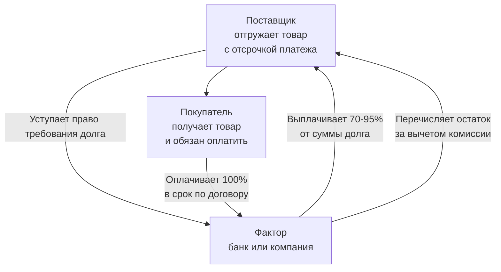

**Факторинг** — это финансовый сервис, при котором компания продает свои **дебиторские задолженности** (долги от покупателей) третьей стороне (**фактору**) и сразу получает за них большую часть денег, не дожидаясь срока оплаты по счету.

---

### Простая аналогия из жизни

Представьте, что вы фрилансер и выполнили работу для клиента на 100 000 рублей. Клиент готов заплатить, но только через 60 дней.

**Проблема:** Вам нужны деньги *сейчас*, чтобы заплатить за аренду, купить новое оборудование или просто жить.

**Решение с факторингом:** Вы обращаетесь в факторинговую компанию. Она покупает у вас право на получение этих 100 000 рублей. И сразу переводит вам на счет, например, 90 000 рублей. Через 60 дней клиент переведет 100 000 рублей уже факторинговой компании.

**Итог:** Вы получили деньги сразу, а не ждали 2 месяца. Факторинговая компания заработала на этой операции 10 000 рублей.

---

### Кто участвует в сделке?

В факторинге всегда три стороны:

1.  **Поставщик (кредитор)** — компания, которая отгрузила товар или оказала услугу с отсрочкой платежа. Она продает свою дебиторскую задолженность.
2.  **Покупатель (дебитор)** — компания, которая получила товар или услугу и должна за них заплатить через какое-то время.
3.  **Фактор (финансовый агент)** — специализированная компания или банк, который выкупает задолженность у поставщика и берет на себя риски и ожидание платежа.

### Как работает факторинг? (Пошагово)

1.  **Поставка товара/услуги.** Поставщик отгружает товар покупателю на условиях отсрочки платежа (например, на 60 дней).
2.  **Уступка права требования.** Поставщик и Фактор заключают договор. Поставщик передает Фактору право требовать долг с покупателя.
3.  **Финансирование.** Фактор немедленно перечисляет поставщику большую часть суммы долга (обычно **70-95%**).
4.  **Оплата от покупателя.** В срок, указанный в договоре, покупатель оплачивает уже не поставщику, а Фактору 100% стоимости поставки.
5.  **Окончательный расчет.** Фактор перечисляет поставщику оставшуюся часть суммы (**5-30%**) за вычетом своей комиссии.

Схематично это выглядит так:

### Зачем это нужно? Основные цели и выгоды

**Для Поставщика:**
*   **Ускорение оборачиваемости денег:** Деньги поступают сразу, а не через месяцы. Их можно снова вложить в бизнес.
*   **Финансирование без кредита:** Это не заем, а продажа актива (дебиторки). Не увеличивается долговая нагрузка в балансе.
*   **Защита от рисков неплатежа:** При виде факторинга "**без регресса**" фактор берет на себя риск того, что покупатель не заплатит.
*   **Упрощение управления долгами:** Не нужно вести претензионную работу с должниками, этим занимается фактор.

**Для Покупателя:**
*   **Получение товарного кредита:** Можно получить отсрочку платежа у поставщика, не отвлекая свои оборотные средства и не оформляя кредит в банке.

### Виды факторинга

| Вид | Суть | Кому подходит |
| :--- | :--- | :--- |
| **С регрессом** | Если покупатель не платит, Фактор потребует деньги обратно с Поставщика. | Для надежных контрагентов, когда риск неплатежа низкий. Дешевле. |
| **Без регресса** | Фактор полностью берет на себя риск неплатежа. Поставщик получает деньги безвозвратно. | Для новых или ненадежных покупателей. Дороже. |
| **Открытый** | Покупатель уведомлен о том, что его долг продан Фактору, и платит напрямую ему. | Самый распространенный вид. |
| **Закрытый (Конфиденциальный)** | Покупатель НЕ знает о факторинге и платит поставщику, а тот уже переводит деньги Фактору. | Если поставщик не хочет афишировать свои финансовые операции. |
| **Реверсивный** | Инициатором выступает не поставщик, а **покупатель**. Он просит фактора обеспечить ему отсрочку у поставщиков. | Крупным покупателям (сетям, ритейлерам) для оптимизации своих платежей. |

### Плюсы и минусы факторинга

**Плюсы (+):**
*   Ускорение оборота капитала.
*   Финансирование без залога и кредитной истории.
*   Страхование рисков неплатежа.
*   Внебалансовое финансирование.

**Минусы (-):**
*   **Стоимость:** Комиссия фактора — это плата за ускорение денег и снижение рисков. Она выше, чем процент по классическому кредиту.
*   **Зависимость от платежеспособности дебитора:** Фактор проверяет не вас, а вашего покупателя. Если у вашего клиента плохая репутация, фактор может отказать.
*   **Сложность учета:** Необходимость вести отдельный учет операций по уступке прав требований.

**В итоге,** факторинг — это мощный инструмент для роста бизнеса, который позволяет продавать в кредит, не испытывая кассовых разрывов. Он особенно популярен в ритейле, оптовой торговле и сфере услуг.